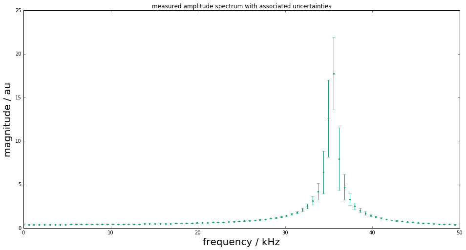
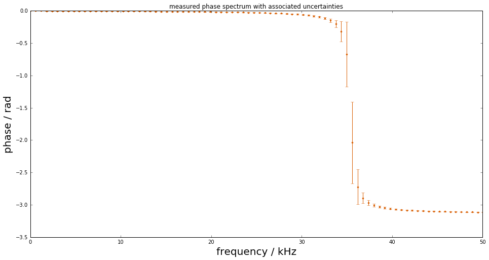
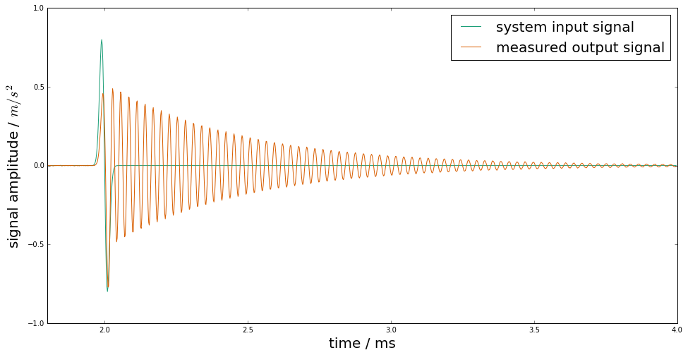
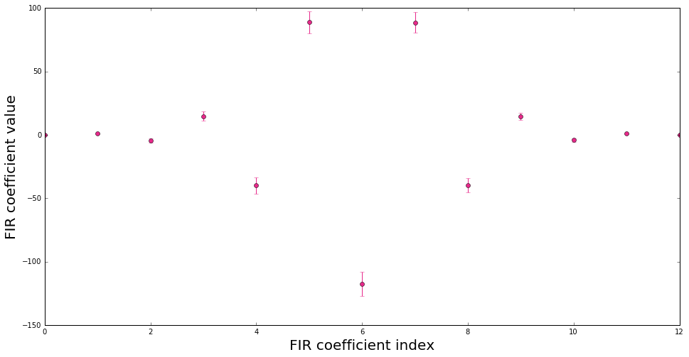
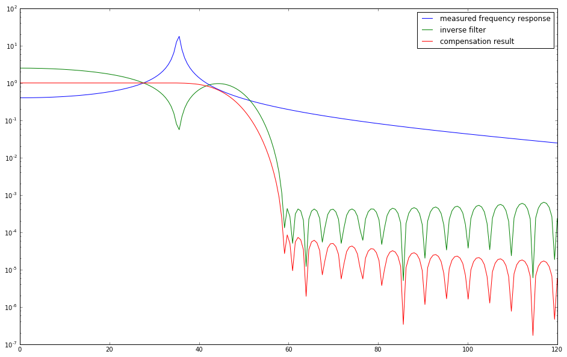
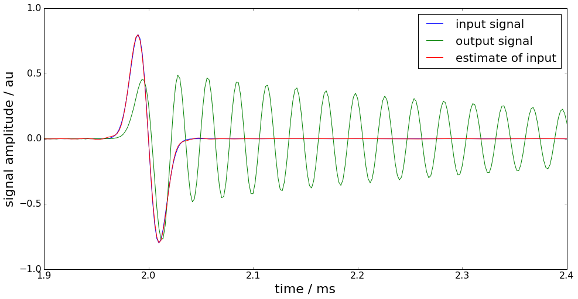
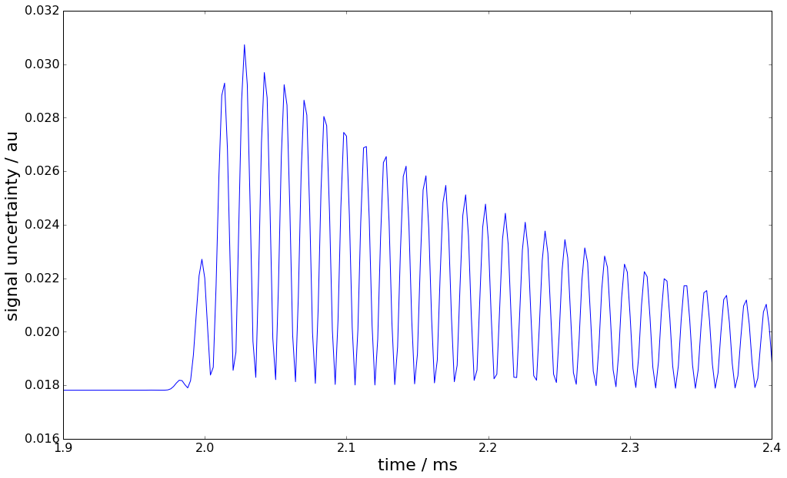

.. code:: python

    %pylab inline
    import numpy as np
    import scipy.signal as dsp
    from palettable.colorbrewer.qualitative import Dark2_8

    colors = Dark2_8.mpl_colors
    rst = np.random.RandomState(1)

.. parsed-literal::

    Populating the interactive namespace from numpy and matplotlib

Design of a digital deconvolution filter (FIR type)
===================================================

.. code:: python

    from PyDynamic.deconvolution.fit_filter import LSFIR_unc
    from PyDynamic.misc.SecondOrderSystem import *
    from PyDynamic.misc.testsignals import shocklikeGaussian
    from PyDynamic.misc.filterstuff import kaiser_lowpass, db
    from PyDynamic.uncertainty.propagate_filter import FIRuncFilter
    from PyDynamic.misc.tools import make_semiposdef

.. code:: python

    # parameters of simulated measurement
    Fs = 500e3
    Ts = 1 / Fs

    # sensor/measurement system
    f0 = 36e3; uf0 = 0.01*f0
    S0 = 0.4; uS0= 0.001*S0
    delta = 0.01; udelta = 0.1*delta

    # transform continuous system to digital filter
    bc, ac = sos_phys2filter(S0,delta,f0)
    b, a = dsp.bilinear(bc, ac, Fs)

    # Monte Carlo for calculation of unc. assoc. with [real(H),imag(H)]
    f = np.linspace(0, 120e3, 200)
    Hfc = sos_FreqResp(S0, delta, f0, f)
    Hf = dsp.freqz(b,a,2*np.pi*f/Fs)[1]

    runs = 10000
    MCS0 = S0 + rst.randn(runs)*uS0
    MCd  = delta+ rst.randn(runs)*udelta
    MCf0 = f0 + rst.randn(runs)*uf0
    HMC = np.zeros((runs, len(f)),dtype=complex)
    for k in range(runs):
        bc_,ac_ = sos_phys2filter(MCS0[k], MCd[k], MCf0[k])
        b_,a_ = dsp.bilinear(bc_,ac_,Fs)
        HMC[k,:] = dsp.freqz(b_,a_,2*np.pi*f/Fs)[1]

    H = np.r_[np.real(Hf), np.imag(Hf)]
    uAbs = np.std(np.abs(HMC),axis=0)
    uPhas= np.std(np.angle(HMC),axis=0)
    UH= np.cov(np.hstack((np.real(HMC),np.imag(HMC))),rowvar=0)
    UH= make_semiposdef(UH)

Problem description
~~~~~~~~~~~~~~~~~~~

Assume information about a linear time-invariant (LTI) measurement
system to be available in terms of its frequency response values
:math:`H(j\omega)` at a set of frequencies together with associated
uncertainties:

.. raw:: latex

   \begin{equation} \mathbf{H} = (\vert H(j\omega_1)\vert,\ldots,\vert H(j\omega_N)\vert,\angle H(j\omega_1),\ldots,\angle H(j\omega_N)) \end{equation}

.. math::  u(\mathbf{H}) = (u(\vert H(j\omega_1)\vert),\ldots,u(\vert H(j\omega_N)\vert),u(\angle H(j\omega_1)),\ldots,u(\angle H(j\omega_N)))

.. code:: python

    figure(figsize=(16,8))
    errorbar(f*1e-3, np.abs(Hf), uAbs, fmt=".", color=colors[0])
    title("measured amplitude spectrum with associated uncertainties")
    xlim(0,50)
    xlabel("frequency / kHz",fontsize=20)
    ylabel("magnitude / au",fontsize=20);

.. code:: python

    figure(figsize=(16,8))
    errorbar(f*1e-3, np.angle(Hf), uPhas, fmt=".", color=colors[1])
    title("measured phase spectrum with associated uncertainties")
    xlim(0,50)
    xlabel("frequency / kHz",fontsize=20)
    ylabel("phase / rad",fontsize=20);

Simulated measurement
---------------------

Measurements with this system are then modeled as a convolution of the
system's impulse response

.. math::  h(t) = \mathcal{F}^{-1}(H(j\omega))

with the input signal :math:`x(t)`, after an analogue-to-digital
conversion producing the measured signal

.. math::  y[n] = (h\ast x)(t_n) \qquad n=1,\ldots,M

.. code:: python

    # simulate input and output signals
    time = np.arange(0, 4e-3 - Ts, Ts)
    #x = shocklikeGaussian(time, t0 = 2e-3, sigma = 1e-5, m0=0.8)
    m0 = 0.8; sigma = 1e-5; t0 = 2e-3
    x = -m0*(time-t0)/sigma * np.exp(0.5)*np.exp(-(time-t0) ** 2 / (2 * sigma ** 2))
    y = dsp.lfilter(b, a, x)
    noise = 1e-3
    yn = y + rst.randn(np.size(y)) * noise

.. code:: python

    figure(figsize=(16,8))
    plot(time*1e3, x, label="system input signal", color=colors[0])
    plot(time*1e3, yn,label="measured output signal", color=colors[1])
    legend(fontsize=20)
    xlim(1.8,4); ylim(-1,1)
    xlabel("time / ms",fontsize=20)
    ylabel(r"signal amplitude / $m/s^2$",fontsize=20);

Design of the deconvolution filter
----------------------------------

The aim is to derive a digital filter with finite impulse response (FIR)

.. math::  g(z) = \sum_{k=0}^K b_k z^{-k}

such that the filtered signal

.. math:: \hat{x}[n] = (g\ast y)[n] \qquad n=1,\ldots,M

<<<<<<< HEAD
is an estimate of the system's input signal at the discrete time points
=======
is an estimate of the system's input signal at the discrete time points.
>>>>>>> devel1

Publication

-  Elster and Link "Uncertainty evaluation for dynamic measurements
   modelled by a linear time-invariant system" Metrologia, 2008

-  Vuerinckx R, Rolain Y, Schoukens J and Pintelon R "Design of stable
   IIR filters in the complex domain by automatic delay selection" IEEE
   Trans. Signal Process. 44 2339–44, 1996

Determine FIR filter coefficients such that

.. math::  H(j\omega) g(e^{j\omega/F_s}) \approx e^{-j\omega n_0 / F_s} \qquad \text{for} \qquad \vert\omega\vert\leq\omega_1

with a pre-defined time delay :math:`n_0` to improve the fit quality
(typically half the filter order).

Consider as least-squares problem

.. math:: (y-Xb)^TW^{-1}(y-Xb)

with - :math:`y` real and imaginary parts of the *reciprocal* and phase
shifted measured frequency response values - :math:`X` the model matrix
with entries :math:`e^{-j k \omega/Fs}` - :math:`b` the sought FIR
filter coefficients - :math:`W` a weighting matrix (usually derived from
the uncertainties associated with the frequency response measurements

Filter coefficients and associated uncertainties are thus obtained as

.. math::  b = \left( X^TW^{-1}X \right)^{-1}X^TW^{-1}y

.. math:: u_b= \left( X^TW^{-1}X \right)^{-1} X^TW^{-1}U_yW^{-1}X\left( X^TW^{-1}X \right)^{-1}

.. code:: python

    # Calculation of FIR deconvolution filter and its assoc. unc.
    N = 12; tau = N//2
    bF, UbF = deconv.LSFIR_unc(H,UH,N,tau,f,Fs)

.. parsed-literal::

    Least-squares fit of an order 12 digital FIR filter to the
    reciprocal of a frequency response given by 400 values
    and propagation of associated uncertainties.
    Final rms error = 1.545423e+01

.. code:: python

    figure(figsize=(16,8))
    errorbar(range(N+1), bF, np.sqrt(np.diag(UbF)), fmt="o", color=colors[3])
    xlabel("FIR coefficient index", fontsize=20)
    ylabel("FIR coefficient value", fontsize=20);

In order to render the ill-posed estimation problem stable, the FIR
inverse filter is accompanied with an FIR low-pass filter.

Application of the deconvolution filter for input estimation is then
carried out as

.. math::  \hat{x}[n-n_0] = (g\ast(g_{low}\ast y)[n]

with point-wise associated uncertainties calculated as

.. math:: u^2(\hat{x}[n-n_0] = b^TU_{x_{low}[n]}b + x_{low}^T[n]U_bx_{low}[n] + trace(U_{x_{low}[n]}U_b)

.. code:: python

    fcut = f0+10e3; low_order = 100
    blow, lshift = kaiser_lowpass(low_order, fcut, Fs)
    shift = -tau - lshift

.. code:: python

    figure(figsize=(16,10))
    HbF = dsp.freqz(bF,1,2*np.pi*f/Fs)[1]*dsp.freqz(blow,1,2*np.pi*f/Fs)[1]
    semilogy(f*1e-3, np.abs(Hf), label="measured frequency response")
    semilogy(f*1e-3, np.abs(HbF),label="inverse filter")
    semilogy(f*1e-3, np.abs(Hf*HbF), label="compensation result")
    legend();

.. code:: python

    xhat,Uxhat = FIRuncFilter(yn,noise,bF,UbF,shift,blow)

.. code:: python

    figure(figsize=(16,8))
    plot(time*1e3,x, label='input signal')
    plot(time*1e3,yn,label='output signal')
    plot(time*1e3,xhat,label='estimate of input')
    legend(fontsize=20)
    xlabel('time / ms',fontsize=22)
    ylabel('signal amplitude / au',fontsize=22)
    tick_params(which="both",labelsize=16)
    xlim(1.9,2.4); ylim(-1,1);

.. code:: python

    figure(figsize=(16,10))
    plot(time*1e3,Uxhat)
    xlabel('time / ms',fontsize=22)
    ylabel('signal uncertainty / au',fontsize=22)
    subplots_adjust(left=0.15,right=0.95)
    tick_params(which='both', labelsize=16)
    xlim(1.9,2.4);

Basic workflow in PyDynamic
---------------------------

Fit an FIR filter to the reciprocal of the measured frequency response

.. code:: python

    from PyDynamic.deconvolution.fit_filter import LSFIR_unc
    bF, UbF = LSFIR_unc(H,UH,N,tau,f,Fs, verbose=False)

with

* ``H`` the measured frequency response values
* ``UH`` the covariance (i.e. uncertainty) associated with real and imaginary
  parts of ``H``
* ``N`` the filter order
* ``tau`` the filter delay in samples
* ``f`` the vector of frequencies at which ``H`` is given
* ``Fs`` the sampling frequency for the digital FIR filter

Propagate the uncertainty associated with the measurement noise and the
FIR filter through the deconvolution process

.. code:: python

    xhat,Uxhat = FIRuncFilter(yn,noise,bF,UbF,shift,blow)

with

* ``yn`` the noisy measurement
* ``noise`` the std of the noise
* ``shift`` the total delay of the FIR filter and the low-pass filter
* ``blow`` the coefficients of the FIR low-pass filter
