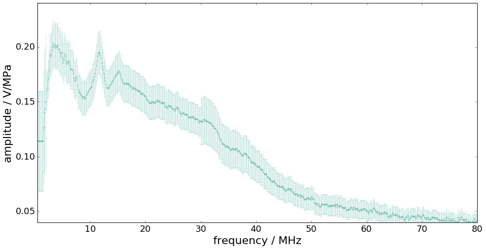
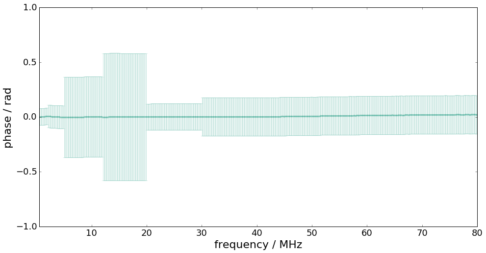
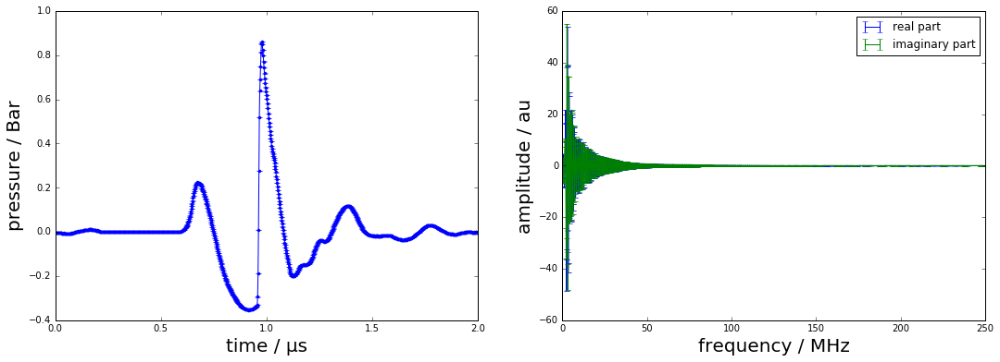
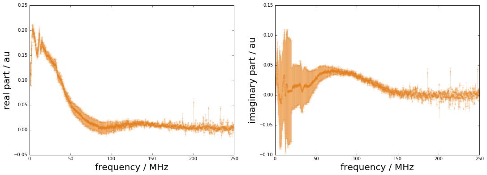
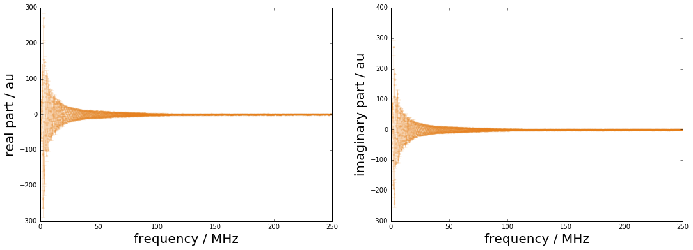
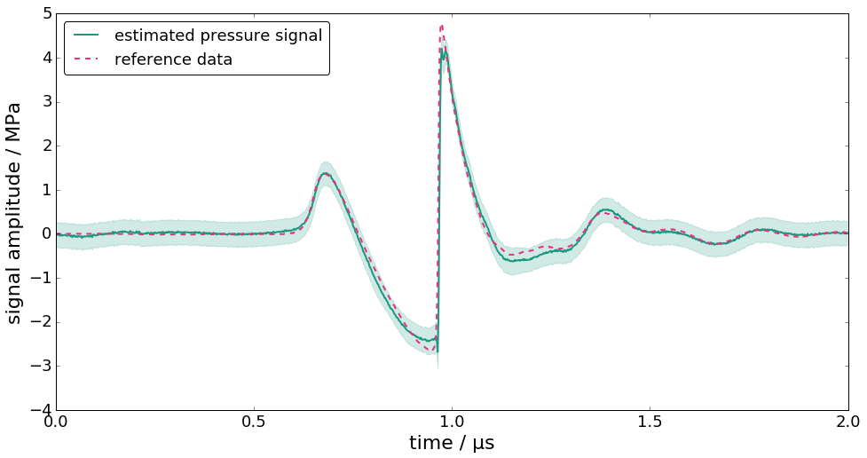
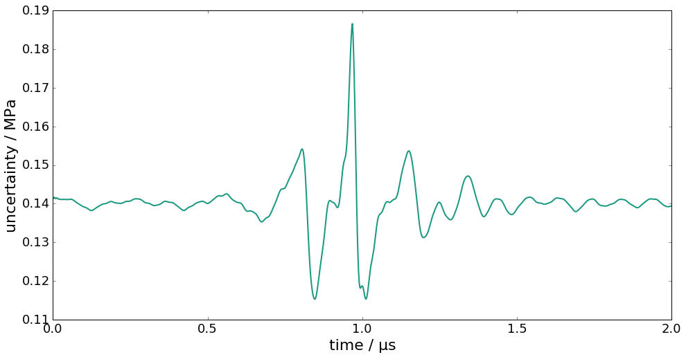

.. code:: python

    %pylab inline
    colors = [[0.1,0.6,0.5], [0.9,0.2,0.5], [0.9,0.5,0.1]]

.. parsed-literal::

    Populating the interactive namespace from numpy and matplotlib

Deconvolution in the frequency domain (DFT)
===========================================

.. code:: python

    from PyDynamic.uncertainty.propagate_DFT import GUM_DFT,GUM_iDFT
    from PyDynamic.uncertainty.propagate_DFT import DFT_deconv, AmpPhase2DFT
    from PyDynamic.uncertainty.propagate_DFT import DFT_multiply

.. code:: python

    #%% reference data
    ref_file = np.loadtxt("DFTdeconv reference_signal.dat")
    time = ref_file[:,0]
    ref_data = ref_file[:,1]
    Ts = 2e-9
    N = len(time)

    #%% hydrophone calibration data
    calib = np.loadtxt("DFTdeconv calibration.dat")
    f = calib[:,0]
    FR = calib[:,1]*np.exp(1j*calib[:,3])
    Nf = 2*(len(f)-1)

    uAmp = calib[:,2]
    uPhas= calib[:,4]
    UAP = np.r_[uAmp,uPhas*np.pi/180]**2

    #%% measured hydrophone output signal
    meas = np.loadtxt("DFTdeconv measured_signal.dat")
    y = meas[:,1]
    # assumed noise std
    noise_std = 4e-4
    Uy = noise_std**2

Consider knowledge about the measurement system is available in terms of
its frequency response with uncertainties associated with amplitude and
phase values.

.. math::  \mathbf{H} = (\vert H(f_1) \vert, \ldots, \angle H(f_N))

.. math::  u_H = (u_{\vert H(f_1) \vert}, \ldots, u_{\angle H(f_N)})

.. code:: python

    figure(figsize=(16,8))
    errorbar(f * 1e-6, abs(FR), 2 * sqrt(UAP[:len(UAP) // 2]), fmt= ".-", alpha=0.2, color=colors[0])
    xlim(0.5, 80)
    ylim(0.04, 0.24)
    xlabel("frequency / MHz", fontsize=22); tick_params(which= "both", labelsize=18)
    ylabel("amplitude / V/MPa", fontsize=22);

.. code:: python

    figure(figsize=(16,8))
    errorbar(f * 1e-6, unwrap(angle(FR)) * pi / 180, 2 * UAP[len(UAP) // 2:], fmt= ".-", alpha=0.2, color=colors[0])
    xlim(0.5, 80)
    ylim(-0.2, 0.3)
    xlabel("frequency / MHz", fontsize=22); tick_params(which= "both", labelsize=18)
    ylim(-1,1)
    ylabel("phase / rad", fontsize=22);

The measurand is the input signal :math:`\mathbf{x}=(x_1,\ldots,x_M)` to
the measurement system with corresponding measurement model given by

.. math::  y[n] = (h\ast x)[n] + \varepsilon[n]

Input estimation is here to be considered in the Fourier domain.

The estimation model equation is thus given by

.. math::  \hat{x} = \mathcal{F}^{-1}\left( \frac{Y(f)}{H(f)}H_L(f) \right)

with - :math:`Y(f)` the DFT of the measured system output signal -
:math:`H_L(f)` the frequency response of a low-pass filter

Estimation steps

1) DFT of :math:`y` and propagation of uncertainties to the frequency
   domain

2) Propagation of uncertainties associated with amplitude and phase of
   system to corr. real and imaginary parts

3) Division in the frequency domain and propagation of uncertainties

4) Multiplication with low-pass filter and propagation of uncertainties

5) Inverse DFT and propagation of uncertainties to the time domain

Propagation from time to frequency domain
^^^^^^^^^^^^^^^^^^^^^^^^^^^^^^^^^^^^^^^^^

With the DFT defined as

.. math:: Y_k = \sum_{n=0}^{N-1} y_n \exp(-\mathrm{j} k\beta_n)

with :math:`\beta_n = 2\pi n /N`, the uncertainty associated with the
DFT outcome represented in terms of real and imaginary parts, is given
by

.. math::

   U_{Y} =
   \left( \begin{array}{cc}  C_{\cos} U_y C_{\cos}^{\sf T} & C_{\cos} U_y C_{\sin}^{\sf T} \\
   (C_{\cos} U_y C_{\sin}^{\sf T})^{\sf T} & C_{\sin} U_y C_{\sin}^{\sf T} \end{array}\right)

.. code:: python

    Y,UY = GUM_DFT(y,Uy,N=Nf)

.. code:: python

    figure(figsize=(18,6))
    subplot(121)
    errorbar(time*1e6, y, sqrt(Uy)*ones_like(y),fmt=".-")
    xlabel("time / µs",fontsize=20); ylabel("pressure / Bar",fontsize=20)
    subplot(122)
    errorbar(f*1e-6, Y[:len(f)],sqrt(UY[:len(f)]),label="real part")
    errorbar(f*1e-6, Y[len(f):],sqrt(UY[len(f):]),label="imaginary part")
    legend()
    xlabel("frequency / MHz",fontsize=20); ylabel("amplitude / au",fontsize=20);

Uncertainties for measurement system w.r.t. real and imaginary parts
^^^^^^^^^^^^^^^^^^^^^^^^^^^^^^^^^^^^^^^^^^^^^^^^^^^^^^^^^^^^^^^^^^^^

In practice, the frequency response of the measurement system is
characterised in terms of its amplitude and phase values at a certain
set of frequencies. GUM uncertainty evaluation, however, requires a
representation by real and imaginary parts.

.. math::

   H_k = A_k \cos(P_k) + \mathrm{j} A_k\sin(P_k)

GUM uncertainty propagation

.. math::

   C_{RI} = \left( \begin{array}{cc} R_{A} & R_{P} \\ I_{A} & I_{P} \end{array}\right) .

.. math::

   U_H = C_{RI} \left( \begin{array}{cc} U_{AA} & U_{AP} \\ U_{AP}^{\sf T} & U_{PP} \end{array} \right)
   C_{RI}^{\sf T} = \left( \begin{array}{cc}  U_{11} & U_{12} \\ U_{21}^{\sf T} & U_{22} \end{array} \right) .

.. code:: python

    H, UH = AmpPhase2DFT(np.abs(FR),np.angle(FR),UAP)

.. code:: python

    Nf = len(f)
    figure(figsize=(18,6))
    subplot(121)
    errorbar(f*1e-6, H[:Nf], sqrt(diag(UH[:Nf,:Nf])),fmt=".-",color=colors[2],alpha=0.2)
    xlabel("frequency / MHz",fontsize=20); ylabel("real part / au",fontsize=20)
    subplot(122)
    errorbar(f*1e-6, H[Nf:],sqrt(diag(UH[Nf:,Nf:])),fmt=".-",color=colors[2],alpha=0.2)
    xlabel("frequency / MHz",fontsize=20); ylabel("imaginary part / au",fontsize=20);

Deconvolution in the frequency domain
^^^^^^^^^^^^^^^^^^^^^^^^^^^^^^^^^^^^^

The deconvolution problem can be decomposed into a division by the
system's frequency response followed by a multiplication by a low-pass
filter frequency response.

.. math::  X(f) = \frac{Y(f)}{H(f)}H_L(f)

which in real and imaginary part becomes

.. math::

   X = \frac{(\Re_Y\Re_H + \Im_Y\Im_H)+\mathrm{j}(-\Re_Y\Im_H+\Im_Y\Re_H)}{\Re_H^2+\Im_H^2}(\Re_{H_L} + \mathrm{j}\Im_{H_L})

Sensitivities for division part

.. raw:: latex

   \begin{align}
       R_{RY} =& \frac{\partial \Re_\chi}{\partial \Re_Y} = \frac{\Re_H}{\Re_H^2+\Im_H^2} \\
       R_{IY} =& \frac{\partial \Re_\chi}{\partial \Im_Y} = \frac{\Im_H}{\Re_H^2+\Im_H^2} \\
       R_{RH} =& \frac{\partial \Re_\chi}{\partial \Re_H} = \frac{-\Re_Y\Re_H^2+\Re_Y\Im_H^2-2\Im_Y\Im_H\Re_H}{(\Re_H^2+\Im_H^2)^2} \\
       R_{IH} =& \frac{\partial \Re_\chi}{\partial \Im_H} = \frac{\Im_Y\Re_H^2-\Im_Y\Im_H^2-2\Re_Y\Re_H\Im_H}{(\Re_H^2+\Im_H^2)^2} \\
       I_{RY} =& \frac{\partial \Im_\chi}{\partial \Re_Y} = \frac{-\Im_H}{\Re_H^2+\Im_H^2} \\
       I_{IY} =& \frac{\partial \Im_\chi}{\partial \Im_Y} = \frac{\Re_H}{\Re_H^2+\Im_H^2} \\
       I_{RH} =& \frac{\partial \Im_\chi}{\partial \Re_H} = \frac{-\Im_Y\Re_H^2+\Im_Y\Im_H^2+2\Re_Y\Im_H\Re_H}{(\Re_H^2+\Im_H^2)^2} \\
       I_{IH} =& \frac{\partial \Im_\chi}{\partial \Im_H} = \frac{-\Re_Y\Re_H^2+\Re_Y\Im_H^2-2\Im_Y\Re_H\Im_H}{(\Re_H^2+\Im_H^2)^2}
   \end{align}

Uncertainty blocks for multiplication part

.. raw:: latex

   \begin{align}
       U_{XRR} =& \Re_{H_L}U_{ARR}\Re_{H_L} - \Im_{H_L}U_{ARI}^T\Re_{H_L} - \Re_{H_L}U_{ARI}\Im_{H_L} + \Im_{H_L}U_{AII}\Im_{H_L} \\
       U_{XRI} =& \Re_{H_L}U_{ARR}\Im_{H_L} - \Im_{H_L}U_{ARI}^T\Im_{H_L} + \Re_{H_L}U_{ARI}\Re_{H_L} - \Im_{H_L}U_{AII}\Re_{H_L} \\
       U_{XIR} =& U_{YRI}^T \\
       U_{XII} =& \Im_{H_L}U_{ARR}\Im_{H_L} + \Re_{H_L}U_{ARI}^T\Im_{H_L} + \Im_{H_L}U_{ARI}\Re_{H_L} + \Re_{H_L}U_{AII}\Re_{H_L}
   \end{align}

.. code:: python

    # low-pass filter for deconvolution
    def lowpass(f,fcut=80e6):
        return 1/(1+1j*f/fcut)**2

    HLc = lowpass(f)
    HL = np.r_[np.real(HLc), np.imag(HLc)]

.. code:: python

    XH,UXH = DFT_deconv(H,Y,UH,UY)

    XH, UXH = DFT_multiply(XH, UXH, HL)

.. code:: python

    figure(figsize=(18,6))
    subplot(121)
    errorbar(f*1e-6, XH[:Nf], sqrt(diag(UXH[:Nf,:Nf])),fmt=".-",color=colors[2],alpha=0.2)
    xlabel("frequency / MHz",fontsize=20); ylabel("real part / au",fontsize=20)
    subplot(122)
    errorbar(f*1e-6, XH[Nf:],sqrt(diag(UXH[Nf:,Nf:])),fmt=".-",color=colors[2],alpha=0.2)
    xlabel("frequency / MHz",fontsize=20); ylabel("imaginary part / au",fontsize=20);

Propagation from frequency to time domain
^^^^^^^^^^^^^^^^^^^^^^^^^^^^^^^^^^^^^^^^^

The inverse DFT equation is given by

.. math::

   X_n = \frac{1}{N} \sum_{k=0}^{N-1}(\Re_k\cos(k\beta_n)-\Im_k\sin(k\beta_n))

The sensitivities for the GUM propagation of uncertainties are then

.. raw:: latex

   \begin{align}
   \frac{\partial X_n}{\partial \Re_k} = &\frac{1}{N}  \qquad & \text{ for } k=0\\
   \frac{\partial X_n}{\partial \Re_k} = &\frac{2}{N} \cos(k\beta_n) &\text{ for } k=1,\ldots,N/2-1\\
   \frac{\partial X_n}{\partial \Im_k} = &0 &\text{ for } k=0\\
   \frac{\partial X_n}{\partial \Im_k} = -&\frac{2}{N}\sin(k\beta_n) &\text{ for } k=1,\ldots,N/2-1 .
   \end{align}

GUM uncertainty propagation for the inverse DFT

.. raw:: latex

   \begin{align}
   C_F U_F C_F^{\sf T} =& \left( \widetilde{C}_{\cos}, \widetilde{C}_{\sin}\right)
   \left( \begin{array}{cc} U_{RR} & U_{RI} \\ U_{IR} & U_{II} \end{array}\right)
   \left( \begin{array}{c} \widetilde{C}_{\cos}^{\sf T} \\ \widetilde{C}_{\sin}^{\sf T} \end{array}\right) \label{eq:DFT2Time}\\
   =& \widetilde{C}_{\cos}U_{RR} \widetilde{C}_{\cos}^{\sf T} + 2\widetilde{C}_{\cos}U_{RI}
   \widetilde{C}_{\sin}^{\sf T} + \widetilde{C}_{\sin}U_{II} \widetilde{C}_{\sin}^{\sf T}
   \end{align}

.. code:: python

    xh,Uxh = GUM_iDFT(XH,UXH,Nx=N)

.. code:: python

    ux = np.sqrt(np.diag(Uxh))

    figure(figsize=(16,8))
    plot(time*1e6,xh,label="estimated pressure signal",linewidth=2,color=colors[0])
    plot(time * 1e6, ref_data, "--", label= "reference data", linewidth=2, color=colors[1])
    fill_between(time * 1e6, xh + 2 * ux, xh - 2 * ux, alpha=0.2, color=colors[0])
    xlabel("time / µs", fontsize=22)
    ylabel("signal amplitude / MPa", fontsize=22)
    tick_params(which= "major", labelsize=18)
    legend(loc= "upper left", fontsize=18, fancybox=True)
    xlim(0, 2);

.. code:: python

    figure(figsize=(16,8))
    plot(time * 1e6, ux, label= "uncertainty", linewidth=2, color=colors[0])
    xlabel("time / µs", fontsize=22)
    ylabel("uncertainty / MPa", fontsize=22)
    tick_params(which= "major", labelsize=18)
    xlim(0,2);

Summary of PyDynamic workflow for deconvolution in DFT domain
^^^^^^^^^^^^^^^^^^^^^^^^^^^^^^^^^^^^^^^^^^^^^^^^^^^^^^^^^^^^^

::

    Y,UY = GUM_DFT(y,Uy,N=Nf)

    H, UH = AmpPhase2DFT(A, P, UAP)

    XH,UXH = DFT_deconv(H,Y,UH,UY)

    XH, UXH = DFT_multiply(XH, UXH, HL)
