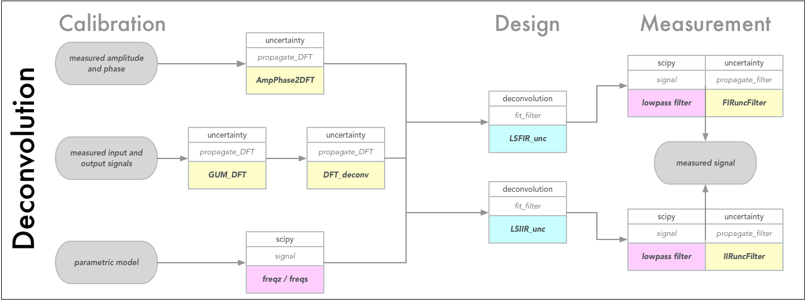

Examples
========

On the project website in the *examples* subfolder and the separate
`PyDynamic_tutorials <https://github.com/PTB-M4D/PyDynamic_tutorials>`_
repository you can find various examples illustrating the application of PyDynamic.
Here we provide only a quick starter.

Quick Examples
--------------

Uncertainty propagation for the application of an FIR filter with coefficients
*b* with which an uncertainty *ub* is associated. The filter input signal is
*x* with known noise standard deviation *sigma*. The filter output signal
is *y* with associated uncertainty *uy*.

.. code-block:: python

    from PyDynamic.uncertainty.propagate_filter import FIRuncFilter
    y, uy = FIRuncFilter(x, sigma, b, ub)

Uncertainty propagation through the application of the discrete Fourier
transform (DFT). The time domain signal is *x* with associated squared
uncertainty *ux*. The result of the DFT is the vector *X* of real and
imaginary parts of the DFT applied to *x* and the associated uncertainty *UX*.

.. code-block:: python

    from PyDynamic.uncertainty.propagate_DFT import GUM_DFT
    X, UX = GUM_DFT(x, ux)

Sequential application of the Monte Carlo method for uncertainty propagation
for the case of filtering a time domain signal *x* with an IIR filter *b,a*
with uncertainty associated with the filter coefficients *Uab* and signal
noise standard deviation *sigma*. The filter output is the signal *y* and the
Monte Carlo method calculates point-wise uncertainties *uy* and coverage
intervals *Py* corresponding to the specified percentiles.

.. code-block:: python

    from PyDynamic.uncertainty.propagate_MonteCarlo import SMC
    y, uy, Py = SMC(x, sigma, b, a, Uab, runs=1000, Perc=[0.025,0.975])

Detailed examples
-----------------

More comprehensive examples you can find in provided Jupyter notebooks, which require
additional dependencies to be installed. This can be achieved by appending
:code:`[examples]` to PyDynamic in the install command, e.g.

.. code-block:: shell

    pip install PyDynamic[examples]

Afterwards you can browser through the following list:

.. toctree::
   :maxdepth: 1

   Deconvolution by FIR.rst
   Uncertainty propagation for IIR filters.rst
   Deconvolution in the DFT domain.rst