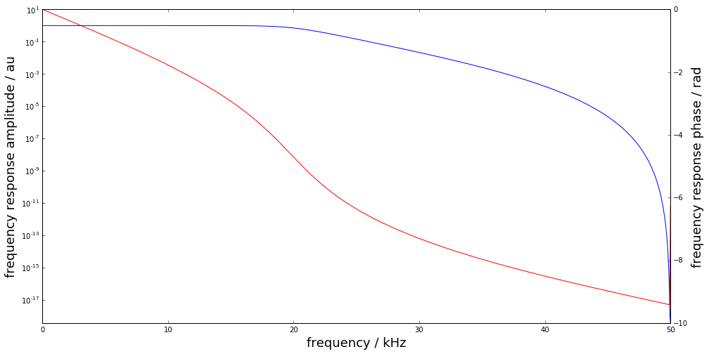
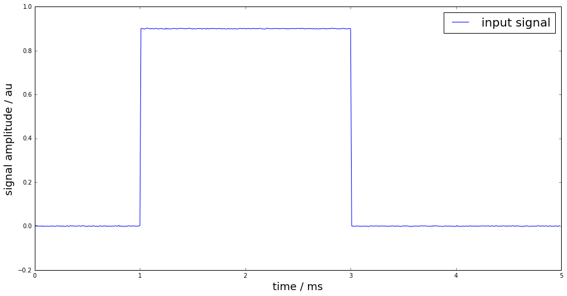
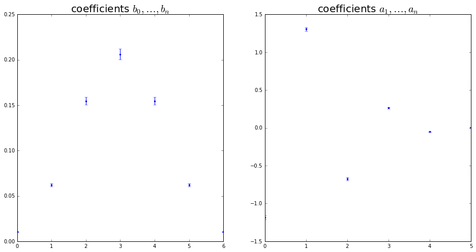
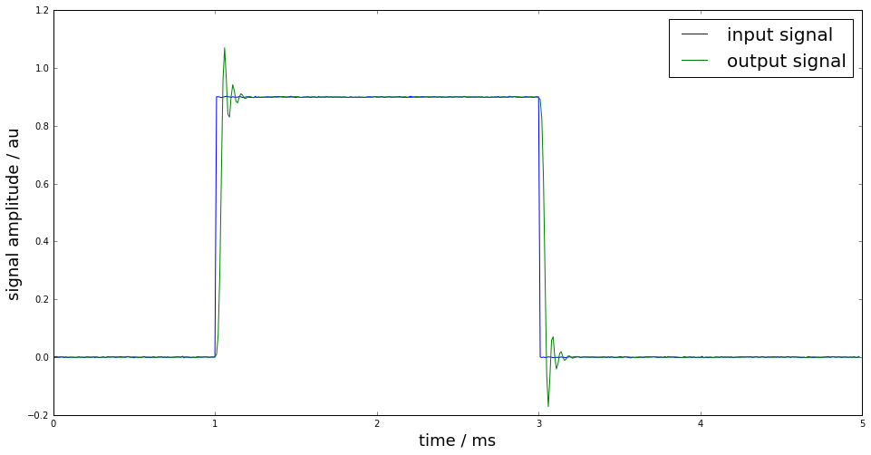
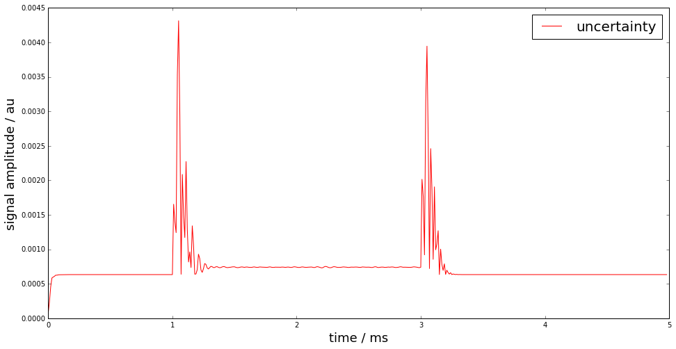
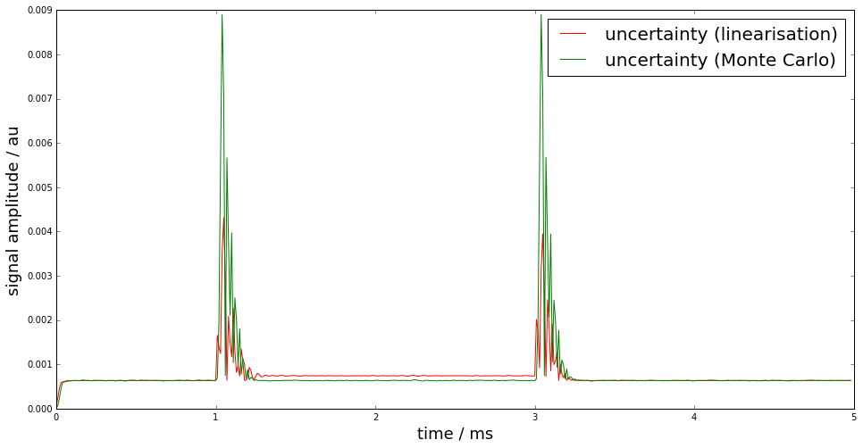

.. code:: python

    %pylab inline
    import scipy.signal as dsp

.. parsed-literal::

    Populating the interactive namespace from numpy and matplotlib

Uncertainty propagation for IIR filters
=======================================

.. code:: python

    from PyDynamic.misc.testsignals import rect
    from PyDynamic.uncertainty.propagate_filter import IIRuncFilter
    from PyDynamic.uncertainty.propagate_MonteCarlo import SMC
    from PyDynamic.misc.tools import make_semiposdef

Digital filters with infinite impulse response (IIR) are a common tool
in signal processing. Consider the measurand to be the output signal of
an IIR filter with z-domain transfer function

.. math::  G(z) = \frac{\sum_{n=0}^{N_b} b_n z^{-n}}{1 + \sum_{m=1}^{N_a} a_m z^{-m}} .

The measurement model is thus given by

.. math::  y[k] = \sum_{n=0}^{N_b} b_n x[k-n] - \sum_{m=1}^{N_a} a_m y[k-m]

As input quantities to the model the input signal values :math:`x[k]`
and the IIR filter coefficients :math:`(b_0,\ldots,a_{N_a})` are
considered.

Linearisation-based uncertainty propagation
-------------------------------------------

Scientific publication

::

    A. Link and C. Elster,
    “Uncertainty evaluation for IIR filtering using a
    state-space approach,”
    Meas. Sci. Technol., vol. 20, no. 5, 2009.

The linearisation method for the propagation of uncertainties through
the IIR model is based on a state-space model representation of the IIR
filter equation

.. raw:: latex

   \begin{align}
    z^\top[n+1] =
       \left(\begin{array}{cccc}
       -a_1   & \cdots & \cdots    & -a_{N_a} \\
       0      &        &           &          \\
       \vdots &        & I_{N_a-1} &          \\
       0      &        &           &          \\
    \end{array}\right) z^\top[n] + \left(\begin{array}{c} 1 \\ 0 \\ \vdots \\ 0 \end{array}\right) X[n], \\
    y[n] = (d_1,\ldots,d_{N_a})z^\top[n] + b_0X[n] + \Delta[n],
   \end{align}

.. raw:: latex

   \begin{align}
   y[n]     =& d^Tz[n] + b_0 y[n] \\
   u^2(y[n])=& \phi^T(n) U_{\mu}\phi(n) + d^T P_z[n]d + b_0^2   ,
   \end{align}

where

.. raw:: latex

   \begin{align*}
       \boldsymbol\phi(n) =& \left(\frac{\partial x[n]}{\partial \mu_1},\ldots,\frac{\partial x[n]}{\partial \mu_{N+N_a+N_b+1}}\right)^T\\
       \mathbf{P}_\mathbf{z}[n] =& \sum_{m<n} \left(\frac{\partial \mathbf{z}[n]}{\partial y[m]}\right)\left(\frac{\partial \mathbf{z}[n]}{\partial y[m]}\right)^T u^2(y[m])   .
   \end{align*}

The linearization-based uncertainty propagation method for IIR filters
provides

-  propagation schemes for white noise and colored noise in the filter
   input signal
-  incorporation of uncertainties in the IIR filter coefficients
-  online evaluation of the point-wise uncertainties associated with the
   IIR filter output

Implementation in PyDynamic
---------------------------

``y,Uy = IIRuncFilter(x,noise,b,a,Uab)``

with

* ``x`` the filter input signal sequency
* ``noise`` the standard deviation of the measurement noise in x
* ``b,a`` the IIR filter coefficient
* ``Uab`` the covariance matrix associated with :math:`(a_1,\ldots,b_{N_b})`

Remark

::

    Implementation for more general noise processes than white noise is considered for one of the next revisions.

Example
-------

.. code:: python

    # parameters of simulated measurement
    Fs = 100e3
    Ts = 1.0/Fs

    # nominal system parameter
    fcut = 20e3
    L = 6
    b,a = dsp.butter(L,2*fcut/Fs,btype='lowpass')

.. code:: python

    f = linspace(0,Fs/2,1000)
    figure(figsize=(16,8))
    semilogy(f*1e-3, abs(dsp.freqz(b,a,2*np.pi*f/Fs)[1]))
    ylim(0,10);
    xlabel("frequency / kHz",fontsize=18); ylabel("frequency response amplitude / au",fontsize=18)
    ax2 = gca().twinx()
    ax2.plot(f*1e-3, unwrap(angle(dsp.freqz(b,a,2*np.pi*f/Fs)[1])),color="r")
    ax2.set_ylabel("frequency response phase / rad",fontsize=18);

.. code:: python

    time = np.arange(0,499*Ts,Ts)
    t0 = 100*Ts; t1 = 300*Ts
    height = 0.9
    noise = 1e-3
    x = rect(time,t0,t1,height,noise=noise)

.. code:: python

    figure(figsize=(16,8))
    plot(time*1e3, x, label="input signal")
    legend(fontsize=20)
    xlabel('time / ms',fontsize=18)
    ylabel('signal amplitude / au',fontsize=18);

.. code:: python

    # uncertain knowledge: fcut between 19.8kHz and 20.2kHz
    runs = 10000
    FC = fcut + (2*np.random.rand(runs)-1)*0.2e3
    AB = np.zeros((runs,len(b)+len(a)-1))

    for k in range(runs):
    	bb,aa = dsp.butter(L,2*FC[k]/Fs,btype='lowpass')
    	AB[k,:] = np.hstack((aa[1:],bb))

    Uab = make_semiposdef(np.cov(AB,rowvar=0))

Uncertain knowledge: low-pass cut-off frequency is between :math:`19.8`
and :math:`20.2` kHz

.. code:: python

    figure(figsize=(16,8))
    subplot(121)
    errorbar(range(len(b)), b, sqrt(diag(Uab[L:,L:])),fmt=".")
    title(r"coefficients $b_0,\ldots,b_n$",fontsize=20)
    subplot(122)
    errorbar(range(len(a)-1), a[1:], sqrt(diag(Uab[:L, :L])),fmt=".");
    title(r"coefficients $a_1,\ldots,a_n$",fontsize=20);

Estimate of the filter output signal and its associated uncertainty

.. code:: python

    y,Uy = IIRuncFilter(x,noise,b,a,Uab)

    figure(figsize=(16,8))
    plot(time*1e3, x, label="input signal")
    plot(time*1e3, y, label="output signal")
    legend(fontsize=20)
    xlabel('time / ms',fontsize=18)
    ylabel('signal amplitude / au',fontsize=18);

.. code:: python

    figure(figsize=(16,8))
    plot(time*1e3, Uy, "r", label="uncertainty")
    legend(fontsize=20)
    xlabel('time / ms',fontsize=18)
    ylabel('signal amplitude / au',fontsize=18);

Monte-Carlo method for uncertainty propagation
----------------------------------------------

The linearisation-based uncertainty propagation can become unreliable
due to the linearisation errors. Therefore, a Monte-Carlo method for
digital filters with uncertain coefficients has been proposed in

::

    S. Eichstädt, A. Link, P. Harris, and C. Elster,
    “Efficient implementation of a Monte Carlo method
    for uncertainty evaluation in dynamic measurements,”
    Metrologia, vol. 49, no. 3, 2012.

The proposed Monte-Carlo method provides - a memory-efficient
implementation of the GUM Monte-Carlo method - online calculation of
point-wise uncertainties, estimates and coverage intervals by taking
advantage of the sequential character of the filter equation

.. math::  y[k] = \sum_{n=0}^{N_b} b_n x[k-n] - \sum_{m=1}^{N_a} a_m y[k-m]

.. code:: python

    yMC,UyMC = SMC(x,noise,b,a,Uab,runs=10000)

    figure(figsize=(16,8))
    plot(time*1e3, Uy, "r", label="uncertainty (linearisation)")
    plot(time*1e3, UyMC, "g", label="uncertainty (Monte Carlo)")
    legend(fontsize=20)
    xlabel('time / ms',fontsize=18)
    ylabel('signal amplitude / au',fontsize=18);

.. parsed-literal::

    SMC progress:  0% 10% 20% 30% 40% 50% 60% 70% 80% 90% 100%

Basic workflow in PyDynamic
---------------------------

Using GUM linearization
^^^^^^^^^^^^^^^^^^^^^^^

.. code:: python

    y,Uy = IIRuncFilter(x,noise,b,a,Uab)

Using sequential GUM Monte Carlo method
^^^^^^^^^^^^^^^^^^^^^^^^^^^^^^^^^^^^^^^

.. code:: python

    yMC,UyMC = SMC(x,noise,b,a,Uab,runs=10000)

.. parsed-literal::

    SMC progress:  0% 10% 20% 30% 40% 50% 60% 70% 80% 90% 100%
